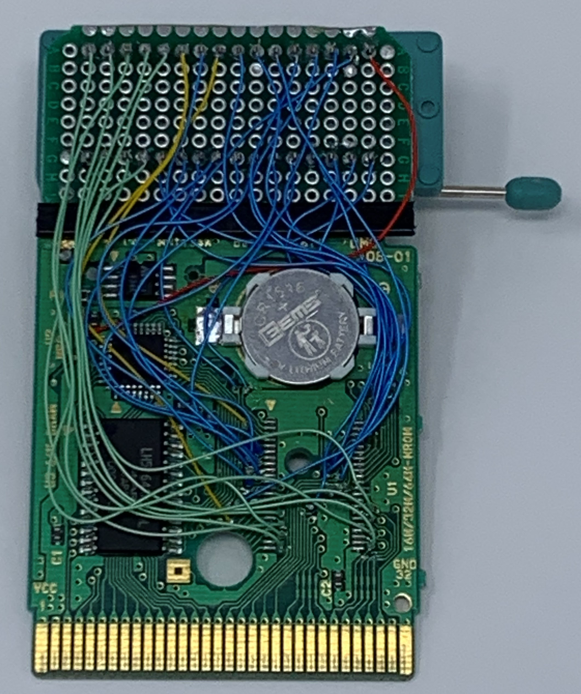
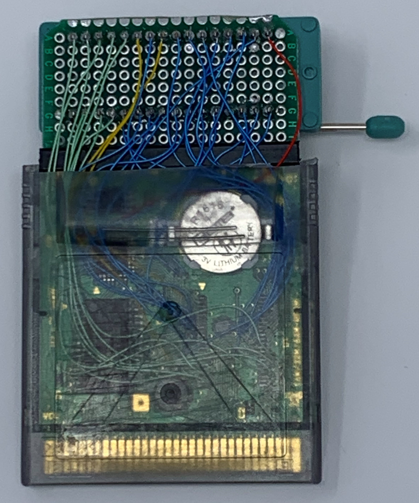
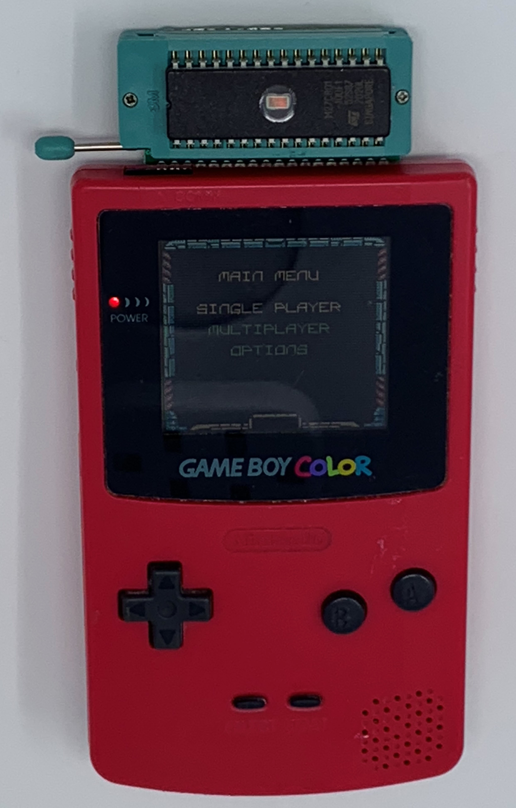

# Building a Development Cartridge

The easiest way to start is to modify an existing cartridge: replace the ROM chip with something programmable.

The cartridge connector is one-sided. It slides into the back of the unit so that the connector pads and parts 
are facing out (not in towards the unit).

The Game Boy allocates the entire lower 32K address space to ROM in the cartridge. Cartridges can include
additional RAM -- often battery-backed for saving game state.

Most cartridges have a memory-mapper chip (MMC) that switches larger ROMs (and RAMs) into smaller banks. There are
different flavor MMCs that support different bank switching features.

# Opening the Cartridge

I bought a special screwdriver to remove the Nintendo screws from cartridges. Here is the insides of Tarzan and the
Adventures of Pooh:

Winnie the Pooh has a battery backed RAM chip, but Tarzan does not. The ROMs for both are 44 pins (tiny pins). My
first development cartridge used an FRAM chip. Read about that at the end of this page.

I used a hot-air pencil to remove the ROM chip from the Winnie the Pooh cartridge. I also removed the soldered-down
CR1616 battery (I'll use a replaceable battery).

The MBC5 chip supports 8M of ROM banked switched into memory from 4000-7FFF as 512 different 16K banks. Bank 0 is 
always mapped to 0000-3FFF. 8M uses address lines A0-A22  (2^23 = 8M).

My development hack uses a 1M EPROM (M27C801). 1M uses address lines A0-A19 (2^20 = 1M).

Address lines A0-A13 are connected to the Game Boy's cartridge connector. Address lines A14-A19 are provided by the
MBC5 memory-mapper.

Here is the pinout for the EPROM:

The Tetris cartridge connects the CE- (chip enable) of the GB ROM to A15. Thus the ROM chip is enabled anytime A15 
is 0 (the entire lower half of the address space). My cartridge does the same.

The Tetris cartridge connects the OE- (output enable) of the GB ROM to RD-. Thus the ROM chip outputs data only when
the CPU requests a READ operation. My cartridge does the same.

I used the continuity check on my meter to find solder pads for all the signals the new EPROM needs:

I cut a small proto board and glued it to the top of the original board. I used a strip of
plastic to enforce the joint. My wire wrap wire just fits in the board's vias making it easy to wire.

I cut the top of the Winnie the Pooh cartridge for my extended board.

Here is the game Asteroids burned into the EPROM:

# An FRAM Cartridge

Ferroelectric RAM (FRAM) retains its state when powered down. You do not erase FRAM like you do UV EPROMs. You simply
write new values. Thus the re-programming cycle is much faster. My EPROM programmer does not program FRAM chips, and
I built a special programmer for it. That was a fun project in itself, but I abandoned it for the UV EPROM version
detailed above. 

I hacked the Tetris cartridge. The Tetris chip is much simpler with fewer pins -- easier to desolder. There is no
extra RAM, and thus no battery back.

Here is the pinout for the FRAM:

FRAM datasheet:
[http://datasheet.octopart.com/FM1808-70-PG-Ramtron-datasheet-8328945.pdf](http://datasheet.octopart.com/FM1808-70-PG-Ramtron-datasheet-8328945.pdf)

I used my meter to find solder pads for the signals I needed for the FRAM:

The FRAM chip is a little tricky in its bus cycle. It uses CE to latch in the address, and a little later you can
assert OE to read from it. The FRAM is also sensitive to the CE level. If the CE driver tristates then the
data can get mangled (and it does in my playing with it). The datasheet strongly suggests using a pullup resistor
on the CE line.

On the GB cartridges, the ROM's CE line is connected directly to the A15 line. As soon as the A15 goes low then the 
remainder of the address is latched into the FRAM chip. Makes sense because the entire A15=0 area is reserved
for the ROM chip.

The Z80 tristates the address lines between access cycles. You must add a pullup resistor (10K does nicely) to the 
CE line in the modified cartridge. Then when A15 tristates between cycles the CE is pulled back up to begin another
access cycle.

I used a 32 pin chip socket for the FRAM even though it only needs 28. That leaves room for future expansion if
I ever rewire it for a larger FRAM.

The FRAM wiring is simple. Use the labeled board picture above. Wire up all the signals D0-D8, A0-A13, RD, CE, 
and RA14 directly from the Nintendo ROM through-holes. Wire up VDD and GND. Wire in a 10K resistor between
VDD and CE.

# Programmer

Many people connect the WR line from the cartridge connector to the FRAM's WR signal. Then they make a cartridge 
reader/writer box to program the cartridge. 

I went with a socketed FRAM chip. You take it off the development cartridge and put it in a programmer to load new code. 
Very old-school.

I made my own programmer using a Propeller prop-stick board.

The propeller output pins are only 3.3V. But the FRAM chip recognizes 2.0 as high. The VDD of the FRAM chip
must be 5V. The propeller tolerates the 5V outputs from the FRAM chip.

Again, the 10K pull-up resistor is very important. You must pull the CE pin to VDD so that the FRAM does not 
get mangled during reset when the propeller chip's GPIO lines are tristated.

## Testing Development Cycle

I downloaded the GB Tetris ROM to my PC. I used my programmer to write it to the FRAM chip. Then I put the
FRAM chip in the cartridge and put it in the GBC. Works great!

