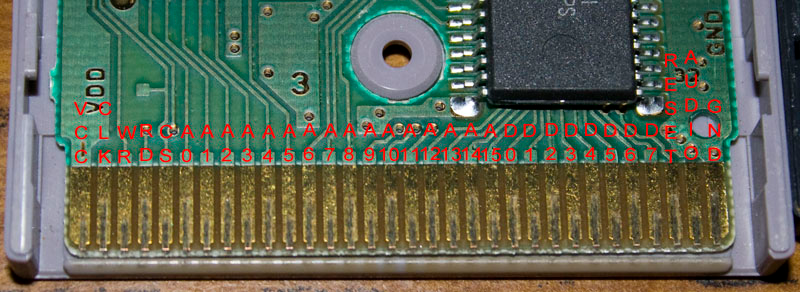

# Nintendo Game Boy

Gameboy/GameboyColor homebrew development is nothing new. There are lots of tutorials on GB/GBC 
hacking (see the links below). This repo is a journal of my experience and any code I produced 
along the way. 

I started with a Game Boy Color and several cartridges I bought from ebay. 

## Links

Nice, concise listing of registers and opcode changes:
[Tech info](http://fms.komkon.org/GameBoy/Tech/Software.html)

[Wikipedia](https://en.wikipedia.org/wiki/Game_Boy_Color)

[http://www.loirak.com/gameboy/gbprog.php](http://www.loirak.com/gameboy/gbprog.php)

[http://gbdev.gg8.se/wiki/articles/Main_Page](http://gbdev.gg8.se/wiki/articles/Main_Page)

[Javascript Emulator and Tutorial](https://imrannazar.com/series/gameboy-emulation-in-javascript)

## Hardware Overview

The Gameboy hardware line is wonderfully backwards compatible. The Gameboy Advanced (GBA) has 
two cartridge slots: one for GBA games and one for old Gameboy/GameboyColor games you may own.

The Gameboy (GB) has a special Z80 processor with a few opcode differences. There is a boot ROM in the console that 
draws a splash screen and transfers control to any cartridge plugged in.

The GameboyColor (GBC) is the GB with additional hardware. The processor and memory layout is the same. GB games play fine 
on the GBC. The GB uses 4 AA batteries (6V). The GBC uses 2 AA batteries (3V) but has a power boot to crank 3V up to 5 to 
run the console and cartridge.

The cartridge connector is one-sided, 32 pins. The signals are power, ground, clock, read, write, chip-select, reset, audio, 16 address lines, and 8 data lines. 

The Z80's address space is split nicely in half. The lower 32K (A15=0) is ROM space in the cartridge. The upper
32K (A15=1) is for hardware registers, system RAM, and an additional 8K RAM area in the cartridge.

Most cartridges include extra RAM (often battery-backed) and ROMs much larger than 32K. Nintendo used a line of
bank-switching chips like MBC5 in each cartridge to select banks of RAM and ROM in the cartridge. I'll discuss
the MBC more in the programming section below. The chip generates the upper address lines (A14 and up) from
internal latches you twiddle by writing to the ROM address space.

## Development Cartridge

The Game Boy emulator is awesome for developing code. But I wanted to run my game on the real hardware. Here
is how I built a programmable development cartridge:

[Building a Development Cartridge](CARTRIDGE.md)

# Game Boy Advanced Development

I wrote code for the Game Boy Advanced years ago. See [Circuit Cellar Magazine, February 2006](http://www.cc-webshop.com/Circuit-Cellar-Issue-187-February-2006-PDF-FI-2006-187.htm). Back 
then I had a nice XPort cartridge to link my computer to the GBA. There was no hardware work
involved -- just C++ and learning the hardware registers on the GBA.